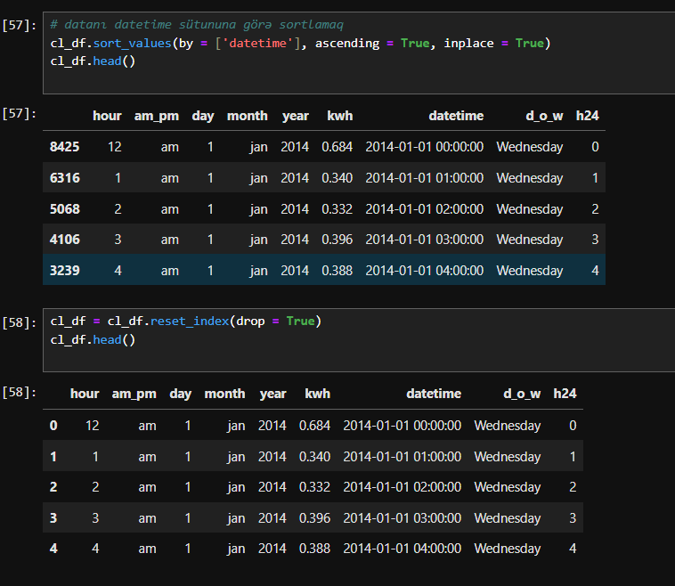

# Electricity Contract Selection Project




## Project Overview
This project analyzes historical electricity usage data from a smart meter to determine the **optimal electricity contract** for minimizing annual electricity costs. Using data cleaning, aggregation, and analysis techniques, we compare three types of electricity contracts:

1. **No Flex:** Constant cost per kWh throughout the year  
2. **Monthly Flex:** Cost per kWh varies by month  
3. **Hourly Flex:** Cost per kWh varies by hour of the day  

The project assumes that your electricity usage remains the same as last year and uses this historical data to simulate the annual costs under each contract.

---

## Dataset Description
The dataset is provided in a workbook with multiple sheets:

- **Usage Sheet:** Hourly electricity usage for the past year, reported by a smart meter.  
- **Contract Sheets:** Cost details for the three electricity contracts.

**Note:**  
- The hour field in the usage data represents the start of the hour (e.g., 8 AM corresponds to usage from 8:00 AM to 8:59 AM).  
- The data may be poorly structured and unsorted, so **data cleaning and preprocessing** is necessary before analysis.

---

## Project Objective
The main objectives of this project are:

1. Clean and structure the raw electricity usage data.  
2. Calculate descriptive statistics, including average hourly and monthly usage.  
3. Identify patterns such as peak usage periods and days of the week with the highest consumption.  
4. Compute electricity costs for each contract type based on historical usage.  
5. Determine which contract minimizes the annual electricity cost.

---

## Questions Answered
The analysis addresses the following key questions:

1. **Average Hourly Electricity Usage**  
   - Determine the mean electricity consumption per hour.

2. **Average Hourly Usage in February**  
   - Calculate the mean electricity usage specifically for February.

3. **Day of the Week with Highest Usage**  
   - Identify which day of the week has the highest average electricity consumption.

4. **Maximum Electricity Usage in a 4-Hour Period**  
   - Find the highest total usage over any continuous 4-hour period.

5. **Annual Cost Under Monthly Flex Contract**  
   - Compute the total cost for the year assuming the Monthly Flex contract.

6. **Optimal Contract Choice**  
   - Based on historical usage, identify which of the three contracts results in the lowest annual cost.

---

## Methodology

1. **Data Cleaning**
   - Load raw usage data into Python using `pandas`.
   - Handle missing or inconsistent values.
   - Sort and structure data chronologically by date and hour.

2. **Exploratory Data Analysis**
   - Aggregate data to compute hourly, daily, and monthly averages.
   - Analyze usage trends by day of the week and time of day.

3. **Cost Calculation**
   - Apply electricity contract rates to the historical usage.
   - Compute total annual costs for **No Flex**, **Monthly Flex**, and **Hourly Flex** contracts.

4. **Visualization**
   - Plot usage trends across hours, days, and months.
   - Visualize costs under different contract options.

---

## Tools and Libraries
The project is implemented in **Python** using:

- `pandas` – Data manipulation and cleaning  
- `numpy` – Numerical computations  
- `matplotlib` & `seaborn` – Data visualization  
- `datetime` – Handling date and time operations  

---

## Results
- **Average hourly electricity usage:** Calculated across the full year.  
- **February hourly usage:** Computed separately.  
- **Day of week with highest usage:** Identified.  
- **Maximum electricity usage over 4 continuous hours:** Computed.  
- **Annual cost for each contract:** Estimated.  
- **Optimal contract choice:** Determined based on minimum annual cost.

---

## How to Run
1. Clone the repository.  
2. Ensure Python and required libraries are installed:  
   ```bash
   pip install pandas numpy matplotlib seaborn
